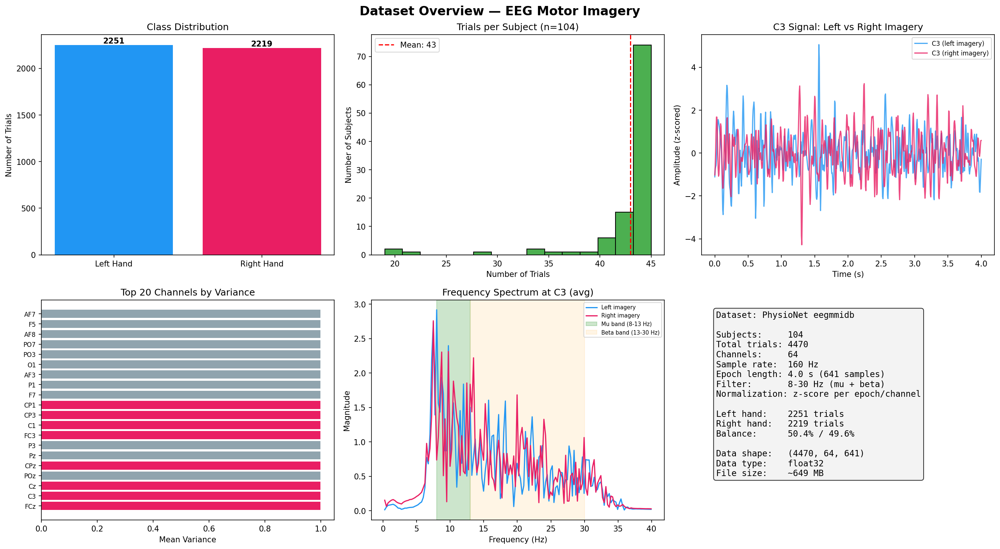
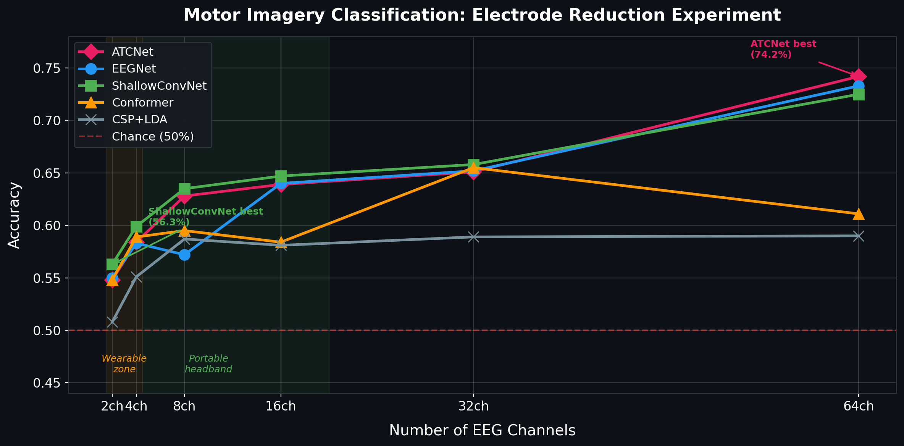
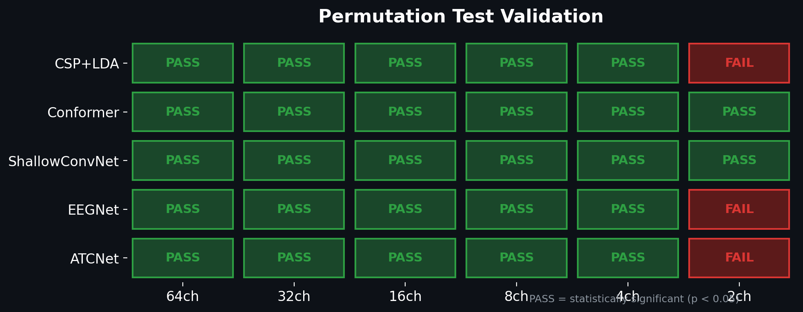
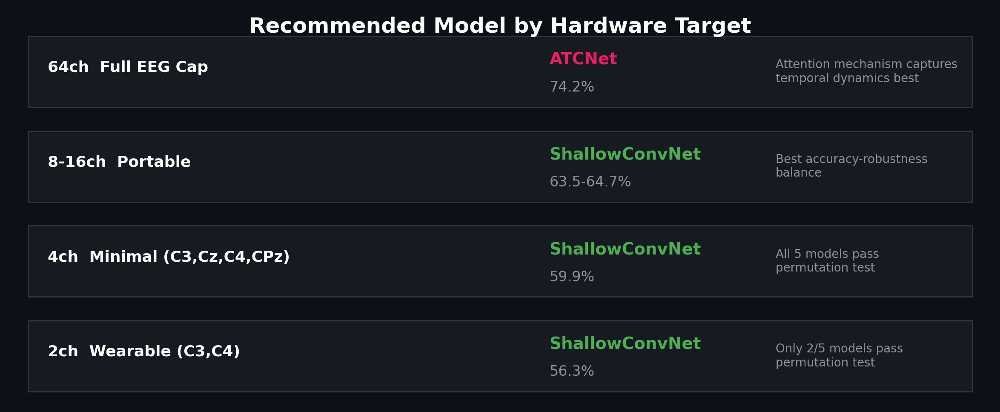

# EEG Motor Imagery: Electrode Reduction Experiment

Clasificación de motor imagery (imaginar mover mano izquierda vs derecha) a partir de señales EEG, con reducción sistemática de electrodos de 64 a 2 canales.

**Curso**: AI in Healthcare — PUCP
**Dataset**: [PhysioNet EEG Motor Movement/Imagery](https://physionet.org/content/eegmmidb/1.0.0/) (109 sujetos, 64 canales, 160 Hz)

## Dataset



## Resultados







## Notebook

[`eeg_electrode_reduction.ipynb`](eeg_electrode_reduction.ipynb) — experimento completo: preprocesamiento, resultados, permutation test y discusión.

## Modelos comparados

Modelos DL implementados via [braindecode](https://braindecode.org/). CSP+LDA via [MNE](https://mne.tools/) + scikit-learn.

| Modelo | Tipo | Parámetros | Referencia |
|--------|------|------------|------------|
| CSP+LDA | Clásico | N/A | Blankertz et al. |
| EEGNet | CNN compacta | ~2K | Lawhern et al., 2018 |
| ShallowConvNet | CNN shallow | ~100K | Schirrmeister et al., 2017 |
| ATCNet | Atención + TCN | ~113K | Altaheri et al., 2022 |
| EEG Conformer | Transformer | ~100-200K | Song et al., 2022 |

## Hallazgos clave

- **ATCNet** domina con 64 canales (74.2%) — la atención temporal captura mejor las dinámicas con información espacial completa
- **ShallowConvNet** domina con pocos canales (56.3% con solo C3+C4) — arquitectura simple resiste mejor la pérdida de información
- **El modelo óptimo depende del número de electrodos** — no existe un modelo universalmente superior
- **Límite práctico validado**: 4 canales (C3, Cz, C4, CPz) — todos los modelos pasan permutation test
- Solo ShallowConvNet y Conformer pasan el permutation test a 2 canales

## Validación

Todos los resultados verificados con **permutation test** (labels reales vs barajados). Evaluación cross-subject con **GroupKFold** por sujeto (sin data leakage).

## Estructura

```
src/
  preprocess.py    # Preprocesamiento: filtrado, epoching, normalización
  model.py         # Arquitectura EEGNet
  train.py         # Entrenamiento y evaluación
  predict.py       # Inferencia CLI
  channels.py      # Configuraciones de canales
models/            # Pesos entrenados (.pt)
modal_deploy.py    # Entrenamiento remoto (Modal GPU)
```

## Infraestructura

Entrenamiento en GPUs remotas via [Modal](https://modal.com) con checkpointing por configuración de canales. Los 5 modelos corren en paralelo (4 GPU + 1 CPU para CSP+LDA).
